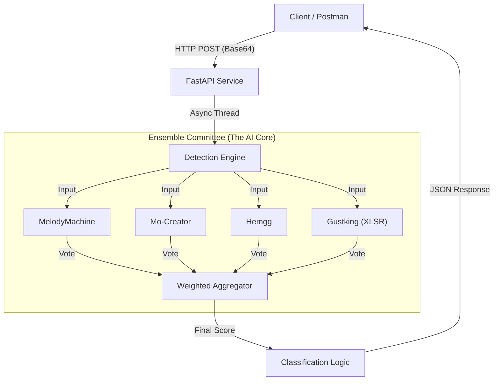

# AudioShield AI: Voice Fraud Detection System

> **Problem Statement 01**: AI-Generated Voice Detection for Regional Languages


## 🚀 Overview
**AudioShield AI** is a high-performance REST API designed to detect AI-generated voice deepfakes with exceptional accuracy. Built for the **GUVI Hackathon**, it specifically addresses the challenge of identifying synthetic audio in **Tamil, English, Hindi, Malayalam, and Telugu**.

Unlike standard detectors, AudioShield uses a **Multi-Model Voting Ensemble** approach, aggregating the intelligence of 4 state-of-the-art Wav2Vec2 models to make a final, highly reliable decision.

## 🎯 Problem It Solves
With the rise of Generative AI, voice scams and deepfakes are becoming indistinguishable from reality. Financial fraud, impersonation, and misinformation are growing threats. AudioShield provides a robust, scalable defense mechanism that can be integrated into calls, messaging apps, and verification systems.

## ✨ Key Features
*   **🛡️ Voting Ensemble Power**: Leverages 4 distinct AI models (MelodyMachine, Mo-Creator, Hemgg, Gustking-XLSR) to minimize false positives.
*   **🌍 Multi-Lingual Support**: Optimized for Indian regional languages (Tamil, Telugu, Hindi, Malayalam) + English.
*   **⚡ Zero Cold Start**: Implements a "Warm-up" routine to ensure the first API request is as fast as the 100th.
*   **🚀 Render-Ready**: Configured for seamless deployment on cloud platforms like Render.
*   **🔍 Explainable AI**: Provides detailed JSON responses with classification confidence and logic.

## 🏗️ System Architecture
The system follows a **Microservices-ready, Layered Architecture**:



### Core Components
1.  **FastAPI Layer (`app.py`)**: Handles HTTP requests, validation, and async processing.
2.  **Detection Engine (`detect.py`)**: Manages model loading, inference, and the ensemble voting logic.
3.  **Models**:
    *   `MelodyMachine/Deepfake-audio-detection-V2`
    *   `mo-thecreator/Deepfake-audio-detection`
    *   `Hemgg/Deepfake-audio-detection`
    *   `Gustking/wav2vec2-large-xlsr-deepfake-audio-classification` (The "Expert" model)

## 🛠️ Tech Stack
*   **Language**: Python 3.10+
*   **API Framework**: FastAPI, Uvicorn
*   **ML Libraries**: PyTorch, Transformers, Librosa, NumPy
*   **Deployment**: Docker-ready, Render-compatible

## 🚀 Installation & Usage

### 1. Clone the Repository
```bash
git clone https://github.com/krish1440/AI-Generated-Voice-Detection.git
cd AI-Generated-Voice-Detection
```

### 2. Install Dependencies
```bash
pip install -r requirements.txt
```

### 3. Run the Server
```bash
python app.py
```
*The server will start on port `8000` (or the PORT env var).*
*Note: On the first run, it will download necessary model weights (approx. 2-3GB).*

## 🔌 API Documentation

### Detect Voice
**Endpoint**: `POST /api/voice-detection`

**Request Body** (JSON):
```json
{
  "language": "Tamil",
  "audioFormat": "mp3",
  "audioBase64": "<Base64 encoded MP3 string>"
}
```

**Response** (Success):
```json
{
  "status": "success",
  "language": "Tamil",
  "classification": "AI_GENERATED",
  "confidenceScore": 0.98,
  "explanation": "Ensemble Analysis: 4/4 models flagged this audio as AI-generated."
}
```

**Response** (Error):
```json
{
  "status": "error",
  "message": "Invalid Base64 encoding."
}
```

## ☁️ Deployment (Hugging Face Spaces)
This project is Dockerized for Hugging Face Spaces.

1.  Create a new **Space** on Hugging Face using the **Docker** SDK.
2.  Connect your GitHub repository.
3.  Hugging Face will automatically build using the `Dockerfile`.
4.  The API will be live at `https://huggingface.co/spaces/YOUR_USERNAME/SPACE_NAME/api/voice-detection`.

**Note**: The Dockerfile builds `ffmpeg` and runs as user `1000` for security compliance on Spaces.
> **Tip**: If the build fails with a registry error, try "Factory Reboot" in the Settings tab.

---
*Developed for GUVI Hackathon.*
